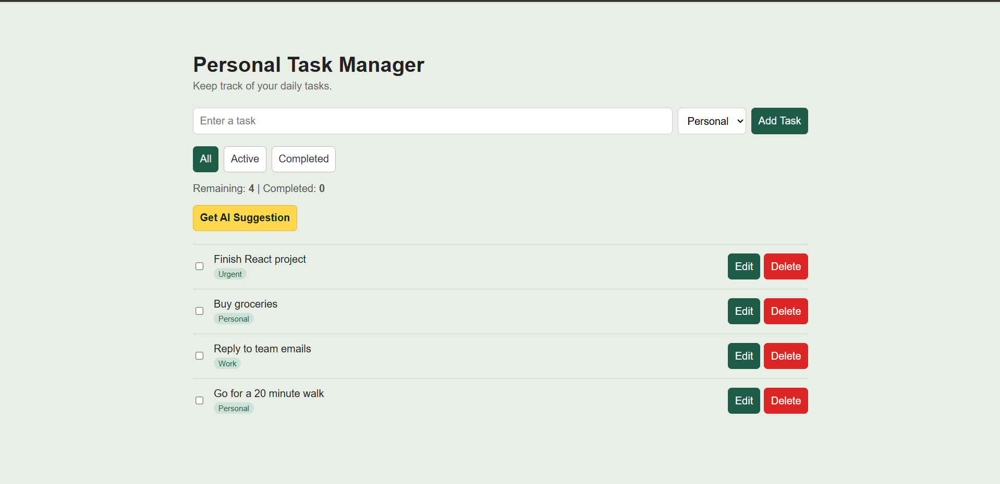
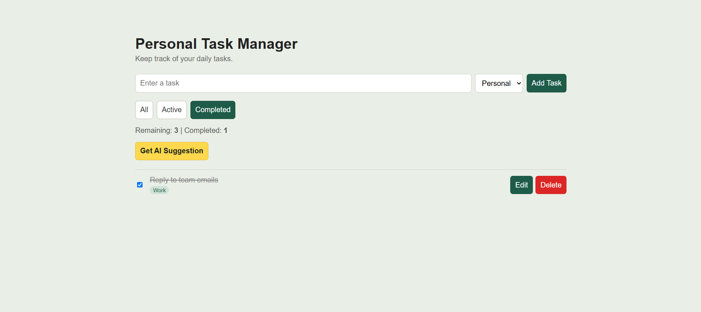
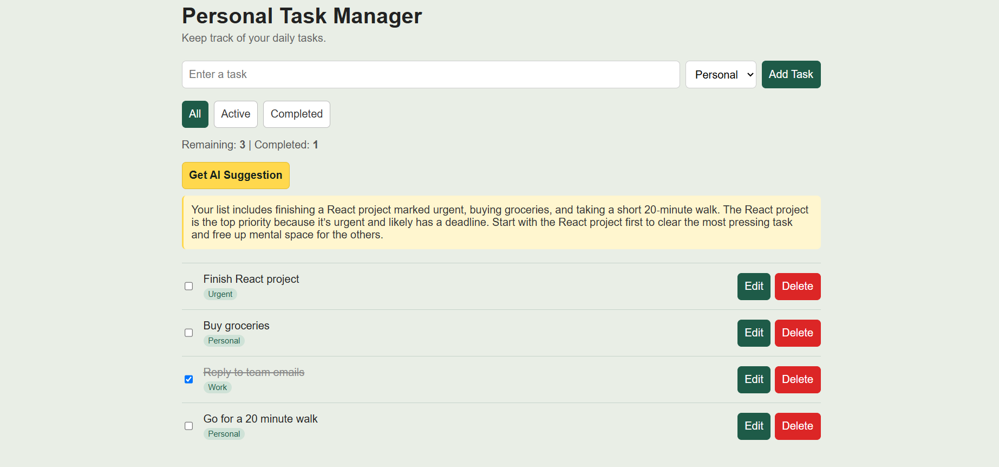

# Personal Task Manager

A React task manager where you can add, edit, organize, and track your daily to-dos. It saves your tasks in the browser and includes an AI button that summarizes your list and suggests what to do first.

## Features

- Add, edit, delete, and mark tasks as complete
- Filter tasks by status: All / Active / Completed
- Organize tasks into categories: Personal, Work, Urgent
- Tasks are saved with localStorage, so they survive a page refresh
- Live count of remaining and completed tasks
- Sample tasks are loaded on the first visit
- Responsive layout for desktop and mobile
- **AI Suggestion button**: sends your active tasks to Groq's AI, which replies with a short summary and which task to do first

## Technologies Used

- React (functional components and hooks)
- Vite
- JavaScript
- CSS
- localStorage
- Groq API (AI suggestions)

## Project Structure

```
src/
  components/
    TaskForm.jsx      # controlled form to add a task
    TaskList.jsx      # renders the list with .map()
    TaskItem.jsx      # one task: checkbox, edit, delete
    FilterBar.jsx     # All / Active / Completed buttons
    StatsBar.jsx      # remaining and completed counts
    AISummary.jsx     # AI suggestion button and result
  utils/
    groq.js           # calls the Groq API
  App.jsx             # main state and logic
  App.css / index.css
```

## Setup Instructions

1. Clone the repository and open the folder in a terminal.
2. Run `npm install`.
3. Get a free API key from [console.groq.com](https://console.groq.com) (API Keys > Create API Key).
4. Create a file named `.env` in the project root (you can copy `.env.example`) and add:
```
   VITE_GROQ_API_KEY=your_actual_key_here
```
5. Run `npm run dev`.
6. Open the local URL shown in the terminal (usually http://localhost:5173).

The `.env` file is excluded from Git so the API key is never pushed to GitHub. The rest of the app works without a key; only the AI button needs it.

## Screenshots





## How the AI Suggestion Works

Clicking "Get AI Suggestion" sends the list of active (not completed) tasks to Groq's chat API. The model replies with a short summary and a recommendation for which task to start with. The code is in `src/utils/groq.js`.

## Known Limitations

- Categories are fixed to Personal, Work, and Urgent.
- No due dates, drag-and-drop ordering, or dark mode (optional stretch goals not implemented).
- The AI feature needs an internet connection and a valid Groq API key.
- The API key is used directly in the browser, which is fine for a course project but not secure for production. A real app would hide the key behind a backend server.
- Groq occasionally retires models. If the AI button returns an error, the model name in `src/utils/groq.js` may need updating.